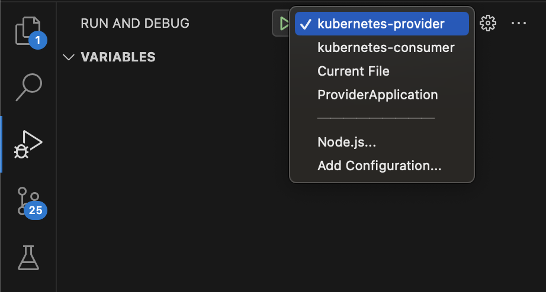

# spring cloud kubernetes demo
## 1. 项目介绍
一个用于演示spring cloud kubernetes的学习项目，包含了spring cloud kubernetes的各种组件的使用方式，以及一些常用的配置方式。

## 2. 项目特性
> 1. 基于kubernetes的服务发现
> 2. 基于kubernetes的配置中心

## 2. 环境准备
> 1. kubernetes集群
> 2. JDK17
> 3. Maven3.x
> 4. VS Code
> 5. VS Code Google Cloud Code插件（用于本地一键启动DEBUG）

## 3. 启动项目
1. 分配权限
```` bash
kubectl apply -f role.yaml
````

2. debug模式启动kubernetes-provider


3. debug模式启动kubernetes-consumer


4. 访问consumer接口
访问consumer的/services/k8s-provider以测试基于kubernetes的服务发现是否生效